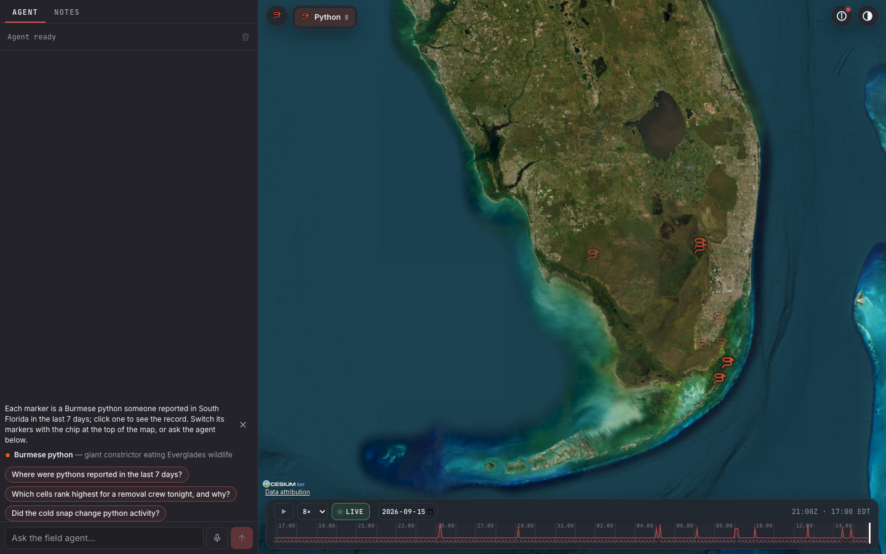
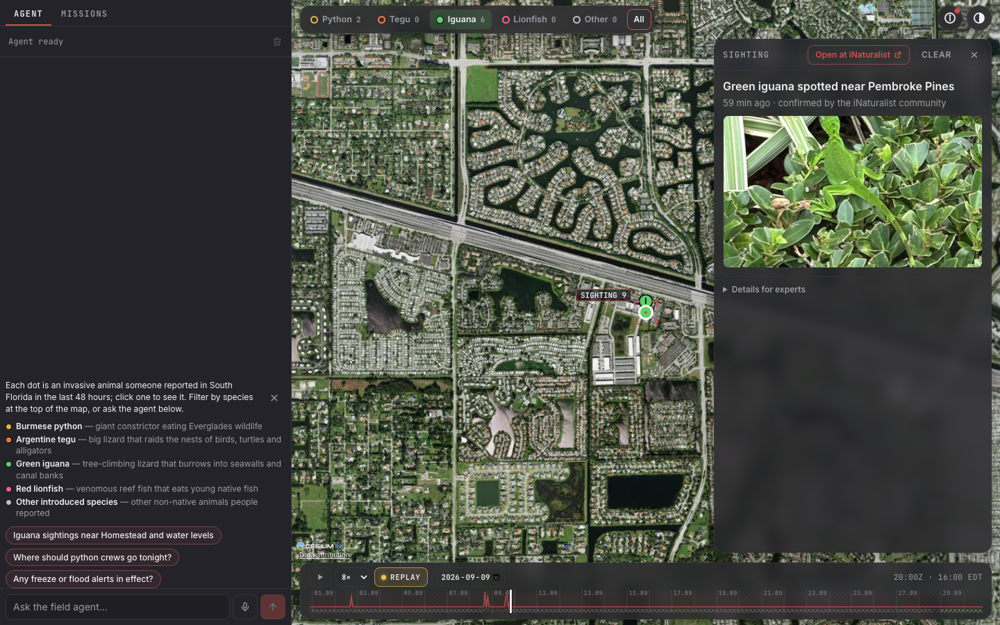

# Everglades Ops

A full-screen command center for one question:

> Where are invasive species active across South Florida right now, and where should removal crews go next?

It tracks four invaders on one map, over land and sea: Burmese python, Argentine tegu, green iguana and lionfish. Ask by voice or text, follow any claim to the raw payload it came from, and scrub 30 days of hourly frames.

- Target URL: https://inversa.calvinmaighan.dev. Not deployed yet; the deploy is waiting on human steps H1–H3 and H8 (see [Deploy](#deploy)).
- Product spec: [docs/PRD.md](docs/PRD.md). Research and the reasons for this question: [docs/research.md](docs/research.md).
- Demo walkthrough: [docs/demo-script.md](docs/demo-script.md). Interview prep: [docs/interview-notes.md](docs/interview-notes.md). Brief checklist: [docs/brief-compliance.md](docs/brief-compliance.md).

## Run locally

### Prerequisites

| Tool | Version checked | Why |
|---|---|---|
| bun | 1.3.14 (`engines.bun >= 1.3`) | workspaces, Next dev server, scripts |
| cargo | 1.96.1 | the Axum API in `api/` |
| CMake and Xcode command line tools | any recent | `hdf5-metno-src` compiles HDF5 into the API binary for the GOES decoder. On Ubuntu: `cmake build-essential zlib1g-dev` |

The first release build compiles HDF5 from source and takes a few minutes. Later builds reuse `api/target/`.

### Steps

```sh
bun install
bun run data      # backfill live iNat, NAS and GBIF into ./data, rebuild frames, load the cold-snap scene
bun run dev       # Axum on 127.0.0.1:4041, Next on http://localhost:3050, signal Worker on 127.0.0.1:8799
```

Open http://localhost:3050 (http://127.0.0.1:3050 works too).

- `bun run data` defaults to 7 days of iNaturalist plus a 5-year NAS and GBIF baseline. `DAYS=30 bun run data` loads 30 days of iNaturalist, the length of the replay window. The GBIF baseline is about 14,500 records and dominates the run time. After the walk it asks iNaturalist for every taxon it stored (`/v1/taxa`, 30 ids per request, one request a second) and keeps each one's common name, group, a two-sentence plain summary, a photo and its iNaturalist page (`api/src/taxon_info.rs`); the running API repeats that sweep every 10 minutes for taxa the pollers add.
- `INVERSA_DATA_DIR=/some/dir` moves the databases and the raw archive. Every script defaults it to `./data`, which git ignores.
- `bun run dev` needs ports 4041, 3050 and 8799 free. The ports are fixed in `scripts/dev.ts` and `apps/web/package.json`, and a second checkout running `bun run dev` blocks them. The signal Worker runs `wrangler dev --local --env dev` from `apps/signal-worker`, the env that allows origin localhost:3050; Ctrl-C stops all three processes.
- The running API polls the live feeds on its own. Set `INVERSA_SOURCES=off` to stop all fetching and work from what is already in the databases.

Offline, with no network at all, load the recorded fixtures instead of `bun run data`:

```sh
INVERSA_SOURCES=off cargo run -q --release --manifest-path api/Cargo.toml -- backfill --fixtures
```

That loads the recorded payloads of all 10 fixture sources, including one real GOES scan, rebuilds 721 hourly frames and prints `BACKFILL-OK`. It took 2 s here.

### Optional keys

Put keys in a `.env.local` at the repo root. Bun loads it for `bun run dev` and passes it to both child processes. Git ignores `.env*`. Nothing below is needed to run the app.

| Variable | Enables | Without it |
|---|---|---|
| `OPENROUTER_API_KEY` | The agent: `openai/gpt-6-luna` on OpenRouter through the cordis harness. `bun run dev` loads it from Doppler `inversa`/`dev` (see [Agent](#agent) below) | `POST /api/agent/stream` answers 503 `agent unavailable: OPENROUTER_API_KEY not set`. There is no mock or fallback model |
| `XAI_API_KEY` | Voice: the grok-voice relay behind `/api/voice/*` | `POST /api/voice/session` answers 503 "Voice mode is not configured". Text chat still works |
| `NEXT_PUBLIC_CESIUM_ION_TOKEN` | The ion imagery rung: Cesium World Terrain, Bing aerial, and Google Photorealistic 3D tiles over Miami and the Keys. Deploys read it from Doppler as `CESIUM_ION_TOKEN` | Keyless Esri World Imagery on the ellipsoid, with OpenStreetMap if Esri fails |
| `GOES_SQS_URL`, `AWS_ACCESS_KEY_ID`, `AWS_SECRET_ACCESS_KEY` | GOES-19 push: SQS long-poll on the NODD `NewGOES19Object` topic, then LST, SST, fire and cloud cells. Setup: [deploy/aws/README.md](deploy/aws/README.md) | The `goes19` feed chip reads DOWN with the note `disabled: GOES_SQS_URL, AWS_ACCESS_KEY_ID, AWS_SECRET_ACCESS_KEY not set` |
| `NWWS_USER`, `NWWS_PASS` | NWS products over NWWS-OI XMPP, seconds after issue | `nwws` reads DOWN. The `nws` poller on `api.weather.gov` covers alerts |
| `R2_ACCOUNT_ID`, `R2_ACCESS_KEY_ID`, `R2_SECRET_ACCESS_KEY`, `R2_BUCKET_RAW` | Raw payloads archived to Cloudflare R2 | Raw payloads go to `<data dir>/archive/raw/<source>/<yyyy>/<mm>/<dd>/` |
| `INGEST_HOOK_SECRET` | The HMAC webhook `POST /v1/ingest/hook/:source` | The hook answers 503 |

### Agent

The agent always calls a real model: `openai/gpt-6-luna` on OpenRouter (`https://openrouter.ai/api/v1`), with `reasoning: {effort: "low"}`. There is no mock mode. `bun run dev` downloads the Doppler `inversa`/`dev` secrets into the child processes' environment without printing them. When doppler is missing or not logged in, it warns and uses the plain environment. A variable already set in your shell wins over Doppler.

Without `OPENROUTER_API_KEY`, `POST /api/agent/stream` answers 503 with `{"error":"agent unavailable: OPENROUTER_API_KEY not set"}`. The chat column shows that error. Nothing falls back to scripted answers.

The daily token budget is `AGENT_DAILY_TOKENS`, 10,000,000 by default. At $0.10/M input and $0.50/M output that is about $1.50 a day, and never more than $5.

## UI



The UI puts sightings first and is written for someone new to the field. On first load the globe shows only sightings: one marker per invasive animal reported in the last 7 days, each its kind's icon (snake, lizard, bird, …) in its kind's colour. A selector next to the species chips switches the window to the last 2, 7 or 30 days; most people upload sightings a few days after they see them, so 7 days shows the most. Weather stations, alerts, hotspots and temperature layers are off and sit under About, in **More data (for experts)**. An alert the agent cites still shows as a bracket.

The page has two panes. The **chat column** sits on the left: always open, full height and 420 px wide. Drag its right edge to make it anywhere from 360 to 560 px wide, and your browser keeps that width. It has two tabs:
- **Agent**: the thread and the composer, with a mic button for voice and a send button.
- **Notes**: the team board. Field notes first (write what you saw, pinned to a spot on the globe), then team chat and who is online, with crew missions folded away at the bottom.

A dot on a tab means something new arrived there while you were on the other one. The **globe** fills the right pane, with the species chips, two icon buttons, the timeline and the evidence card inside it. Below 768 px wide, the globe goes full screen and the column becomes a bottom sheet with the same tabs. When collapsed, the sheet is a composer bar. Drag or tap its handle to open it to half or full height.

On a first visit, a welcome above the composer says what the map is in two sentences, describes each species in one line ("Burmese python — giant constrictor eating Everglades wildlife"), and offers example questions you can click, such as "Iguana sightings near Homestead and water levels" and "Where should python crews go tonight?". Dismiss it and it stays dismissed.

Click a dot and the evidence card opens with a plain summary first, for example "Green iguana spotted near Coral Gables · 2 h ago · confirmed by the iNaturalist community", the photo when there is one, and "Open at iNaturalist ↗". Every species gets the same card, not only the focus four: a brown anole's reads "Brown anole spotted near Homestead", then *Anolis sagrei* · introduced reptile, the observer's photo (or the species' photo when there is none), one About line from Wikipedia ("The brown anole (Anolis sagrei) is a lizard native to Cuba and the Bahamas…") and "More about Brown anole on iNaturalist ↗" in a new tab. The id, the normalized record, the raw payload, the source feed, links and revisions sit under a collapsed **Details for experts**. An API binary older than the app degrades instead of failing: a field it does not know is retried without, and Details for experts says to restart the API.



### What the colours on the globe mean

The species chips at the top left carry the sighting colours. The full legend, with a switch and a live count for every layer, is under About (ⓘ) in **More data (for experts)**. The **Layers** rows there turn the expert layers on.

| Mark | Meaning |
|---|---|
| Icons: amber `#e3b341`, orange `#ff7a45`, green `#5fd068`, pink `#ff5c9a` | Sightings of Burmese python (a snake icon), Argentine tegu and green iguana (lizard icons) and red lionfish (a fish icon). Every other species draws its kind's icon in its kind's colour (snakes, lizards, turtles, crocodilians, frogs, birds, mammals, fish, snails, insects, spiders, plants, other; `docs/icons.md`), so a brown anole is the same teal lizard on the globe, in its chip, in the Other popover and in the legend; nothing is grey. Markers show the selected window (2, 7 or 30 days) and fade with age, so the newest are brightest. A red ring means the IDs conflict, and a white ring marks the selected sighting, drawn larger. |
| Squares: blue `#4fb3ff`, teal `#3fd6c6`, violet `#c89bff` | Expert layer, off by default. In-situ stations that reported in the two hours before the cursor: a USGS water gauge, an NDBC buoy, or a NOAA (CO-OPS) tide gauge. |
| Haze from violet to yellow | Expert layer, off by default. Hotspots, on a heuristic score from low to high. The legend can pin the haze to a single species. |
| Ramp from blue to red | Expert layers, off by default. Land and sea surface temperature (LST 0–45 °C, SST 16–33 °C). |
| Outlined areas: red, orange, amber, teal | Expert layer, off by default. NWS alerts in effect at the cursor, coloured by severity: extreme, severe, moderate, minor. |
| Outlined pins in a teammate's colour | Field notes: what someone on the team wrote at that spot. Hover to read the first line, click to open it. |
| Diamonds: yellow, orange, green | Missions on the team board that are planned, in progress or done. |
| Small coloured dots with callsigns | Team cursors: teammates on the same board. |
| Diagonal hatching | Missing data, never zero. On the rasters it marks cloud-masked cells. On the timeline's thin bottom lane, red means no satellite data, amber means cloud, and grey means no sightings for 12 h or more; hover the timeline to see which. |
| Brackets | What the agent cited or highlighted, and the current selection. Only the selection, the hovered row and citations get a text label, 12 at most. Station readings are bracketed only when cited. |

Hover a sighting to see the species first, then how sure the ID is, for example "Green iguana · research · iNat · 2 h ago" or "Brown anole · needs ID · 3 h ago". Click it to open its record. The agent knows every species too: ask "what invasive animals were seen near Homestead this week?" and it answers with the species by name and their counts (`species_counts`), and "brown anole sightings near Homestead" works like the focus species do.

### Controls

**Help**, inside About, opens a help sheet that lists every control. Its content comes from one file, [`apps/web/client/hud/help/content.ts`](apps/web/client/hud/help/content.ts). A unit test fails when this table and that file disagree.

| Where | Control | What it does |
|---|---|---|
| Map | Species chips | Top left: Python, Tegu, Iguana and Lionfish pinned first (dimmed at 0), then the six animals seen most in the window (three on a phone), each with its kind's icon in its colour and its count, then Other. Hover a chip for a one-line description. Click to show or hide one; Alt-click (or press and hold) to show only that one; All brings every animal back. Other opens every kind (snakes, lizards, turtles & tortoises, crocodilians, frogs & toads, birds, mammals, fish, snails & slugs, insects, spiders, plants, other) with its icon, colour, count and switch, and each kind's most-seen species with their own switches; insects, spiders, plants and other are off until switched on. The globe, the legend, the timeline line and the agent's view all follow it. |
| Map | Sightings window | Next to the chips: last 2, 7 or 30 days (7 days to start). The agent's view follows it. |
| Map | Sighting markers | One per animal reported in the window: its kind's icon (snake, lizard, turtle, frog, bird, …) in its colour, brightest when newest, drawn as Cesium billboards from one texture atlas (one image per kind and colour, never one per marker). A white ring marks the selected one, a red ring an ID conflict. Hover for the species and the ID's grade; click to open the record. |
| Map | Evidence card | A plain summary (what, where, when, how sure), the species' Latin name and a line about it, the photo, the species' iNaturalist page and the publisher link, with the raw record under Details for experts. |
| Map | About (ⓘ) | Top right: what this map is, how fresh its data is in plain words, Focus, Help, Data sources and More data (for experts). A small dot on it shows the worst feed's colour when a source is delayed. |
| Map | Data sources | Inside About: one row per source with its health (nominal, lagging, stale or down), push or poll, and lag, worst first. |
| Map | More data (for experts) | Inside About: a switch, legend and live count for every layer, plus the data-gaps key. |
| Map | Focus | Inside About: dims the globe outside a circle around the selection. |
| Map | Theme (◐) | Top right: light, dark or tactical, remembered. |
| Map | Help | Inside About: opens the help sheet. |
| Map | Share links | The address bar always holds the camera, time, layers, species (chips and window) and selection. |
| Timeline | Play / pause (Space) | Plays time forward at the chosen speed. |
| Timeline | Speed | Sets playback speed in frames per second. |
| Timeline | LIVE / REPLAY | Shows whether you are looking at now or the past; click it while replaying to jump to now. |
| Timeline | Date jump | Loads any UTC day, including days outside the 30-day window. |
| Timeline | Scrubber | Drag through time, or step with the arrow keys. The line is sightings (following the species chips); hatching marks gaps. |
| Map (carp) | Location markers | One per demonstration river location, status in shape, icon and colour (◆ ! needs review, ● ✓ no rule fired, dashed ■ ? cannot assess), freshness as a ring. Enter or click opens the briefing. |
| Map (carp) | Review board | Every location, those needing review first, with reasons in words; camera presets All sites and Atchafalaya Basin; the boundary notice (conditions only, not carp abundance, catch, access or trip safety). |
| Map (carp) | Location briefing | What changed, what is expected, what is missing; readings with units, datums and times; forecast issuance and source (NWPS live or IEM archive); thresholds; alerts; source pages in a new tab. |
| Timeline (carp) | Stage timeline | USGS gauge height and NWPS observed stage, the NWPS forecast with the spread of recent issuances, flood thresholds, alerts, the replay-coverage marker, and "sources disagree" chips. |
| Timeline (carp) | What we knew | Scrub, or press "What we knew yesterday afternoon": everything shows what was held at that time and draws later observations apart. Play replays to now; LIVE returns. |
| Chat column | Agent tab | Ask the agent. Answers cite evidence, show their tool rows and data panels, and fly the globe. |
| Chat column | Notes tab | Write a note about what you saw (pick a spot on the globe, or start from a sighting's card), read everyone's notes live, chat with the team and see who is online. Crew missions fold out at the bottom. |
| Chat column | Mic | Talk instead of typing. Press it again to stop. |
| Chat column | Citations [1] [2] … | Open the cited record in the evidence card. |
| Chat column | Data panels and Expand | Show the tables and charts behind an answer. Expand opens them wide next to the column. |
| Chat column | Column edge | Drag it, or use the arrow keys, to resize the column. On phones, drag the sheet's handle instead. |

## Architecture

```
 Browser
   main: chat column (Agent | Notes), CesiumJS globe and HUD, mic and playback
   workers: gql (GraphQL HTTP + WS), db (sqlite-wasm OPFS, CRDT, frame cache)
   SharedArrayBuffer rings between them (@calvinjs/active-state/threads)
        |  /v1/*  GraphQL, WS, frames, media        |  /api/agent/*, /api/voice/*  NDJSON
        v                                           v
   Axum API (Rust, 127.0.0.1:4041)             Next 16 on Bun (127.0.0.1:3050)
     push: GOES SQS, NWWS XMPP, HMAC hook         UI shell and static assets
     poll: iNat, NWS, USGS, NDBC, CO-OPS,          agent: cordis + dsh, GPT-6 Luna, OpenRouter
           Open-Meteo, NAS, GBIF                   voice: grok-voice relay
     SQLite: 1 writer thread + read pool           agent tools call /v1/graphql over loopback
     frames + hotspots (rayon), GraphQL, Hub
     raw archive: R2 or a local directory
   Litestream: observations.db and team.db to R2

 Cloudflare Worker + R2: WebRTC rendezvous (SDP and ICE only), TURN credentials
 AWS: one SQS queue subscribed to NOAA's GOES-19 SNS topic
```

Boundaries:

- Only the Axum API writes `observations.db`. The ingest module writes observations and the frame builder writes frames. Only the GraphQL `applyOps` mutation writes team tables.
- The agent has no database access. Its data tools call Axum's GraphQL over loopback. `geocode` reads a local gazetteer, then Open-Meteo's geocoding API, and `set_view` only emits a view event.
- Hotspot scoring exists once, in Rust (`api/src/hotspot/`). The client only draws grids.
- CRDT merge exists twice, in `api/src/crdt.rs` and `apps/web/client/threads/crdt/`. Both pass the same 14 vectors in `spec/crdt/`.
- Only the client db worker touches client SQLite. UI code fetches through `apps/web/client/threads/api.ts`.
- The signal Worker (`apps/signal-worker/`) relays WebRTC handshakes and never sees app data.
- Caddy routes `/v1/*` and `/health` to Axum and everything else to Next. In dev, `apps/web/next.config.ts` rewrites `/v1/*` the same way, and the gql worker opens its WebSocket straight to 4041.

The contracts between these parts are in [PLAN.md](PLAN.md) §C1–C16: the GraphQL SDL (`api/schema.graphql`), the feed-state envelope, the EVF2 frame format, the CRDT op, the SAB transport, the agent NDJSON events, the signaling API and the evidence ids.

## Decisions

### The question

Inversa removes invasive animals in South Florida and the Caribbean. It administers FWC's PATRIC python contractor program, where removals went from 235 in July 2024 to 748 in July 2025 (FWC, 2025-10-21). Its product Origin sells a loop of hotspot, mission, mission in progress and ROI. This app builds that loop on public data in Inversa's own geography. The hotspot half works today; the mission half waits on T21.

Alternatives, all written up in [docs/research.md](docs/research.md) §4: a Caribbean lionfish dive planner (thin real-time signal outside the US), an invasive carp harvest radar for the Mississippi basin (carp are rare in iNaturalist, so the evidence is mostly indirect), and wildfire smoke (rich data, nothing to do with Inversa). The lionfish marine rules are folded into this app.

The price of this choice is that "where should crews go" invites a prediction claim. The app answers with an explainable heuristic, labels it HEURISTIC, and ships a backtest next to it.

### Sources

Each feed answers a different part of the question.

| Feed | Role | Mode |
|---|---|---|
| iNaturalist | where animals were seen, with photos and ID changes; every introduced species in the region (351 taxa after a week), not only the focus four, plus each taxon's name, group, summary and photo from `/v1/taxa` | poll every 2 min, at most 1 request a second |
| USGS NAS | curated history, weeks behind | poll daily |
| GBIF | deep history, and a mirror of iNat research-grade records | poll daily |
| GOES-19 ABI L2 (LSTC, SSTF, FDCC, ACMC) | land and sea surface temperature, fires, cloud | push over SQS |
| NWS | freeze, cold, heat, marine and flood alerts | NWWS-OI push, with the `api.weather.gov` poll every 60 s as fallback |
| USGS Water | Everglades stage and water temperature | poll 15 min |
| NDBC and CO-OPS | buoy water temperature, wind, water level | poll 10 min and 6 min |
| Open-Meteo forecast and marine | air temperature, rain, wind, waves, 48 h forecast | poll hourly |

Live, curated and lagged sources overlap on purpose. The same python can appear in iNat, then GBIF days later, then NAS weeks later, which gives the duplicate, late and conflict cases real data to work on. Not chosen: eBird (no focus species), NASA FIRMS (GOES FDCC covers fires), aisstream (vessel traffic does not answer the question).

### Push vs poll

The brief does not prescribe either. GOES-19 and NWS offer push, so the API takes it: an SQS long-poll on NOAA's SNS topic, and an XMPP client for NWWS-OI. Everything else has no push, so tokio tasks poll it under a per-source rate governor that doubles its interval on 429 or 5xx and honours `Retry-After`. A signed webhook at `/v1/ingest/hook/:source` takes anything else that can push.

Tradeoff: push needs accounts. The SQS queue is human step H4, and NWWS-OI approval can take 10 days or more (H9). Until they exist, GOES shows DOWN with a reason and the NWS poll covers alerts.

The research doc's first plan was Cloudflare Cron Workers that poll each feed and post signed webhooks. PRD v3 moved ingest into the Axum process instead. An SQS long-poll and an XMPP session are long-lived connections, and GOES NetCDF decode is CPU work, while the Workers free plan gives 5 cron triggers and 10 ms of CPU per invocation.

### SQLite and Litestream

Two SQLite files: `observations.db` and `team.db`. One dedicated writer thread owns the write connection and batches commands into transactions; a pool of WAL read connections serves queries through `spawn_blocking`. Litestream streams both files to R2 with a 1 s sync interval, and `deploy/restore.sh` restores them before the API starts on an empty disk.

Alternatives: Postgres with PostGIS or TimescaleDB. They would buy concurrent writers and real spatial indexes, at the cost of a second service to run, back up and pay for on a €5 VM. A single writer fits because one process does all the ingest. The T4 concurrency test runs 8 writer tasks against 8 reader tasks with no `SQLITE_BUSY` (`gates/leaf-T4.md` G2). The limit shows up at volume: GOES alone can write 173,568 readings a day. The PRD's path past that is monthly attached SQLite files, or ClickHouse for analytics.

### EVF2 frames

The timeline replays binary frames, not JSON. EVF2 packs, per hour: four species of u8 hotspot scores on a 0.02° grid (170 × 160), LST and SST as i16 centi-°C on the 0.05° GOES grid (68 × 64), and 16-byte sighting records. The layout is documented in `apps/web/shared/frames.ts`; `spec/frames/sample.evf` is the golden file both languages test against.

EVF1 stored f32 grids at 0.01°, about 2.6 MB per frame and 7.5 GB a month. EVF2 measured 126,278 bytes per frame raw in the T11 benchmark (`gates/leaf-T11.md` G6). GOES itself lands on 0.05° cells for the same reason: the fixture scan measures 7,232 rows per scan, 173,568 per day, under the 250k budget asserted by `goes_fixture_rows_per_scan_under_daily_budget`. Scoring still runs on the 0.01° grid, and `explainCell` answers per 0.01° cell. The frame grid shows the max of each 2 × 2 block.

Tradeoff: a custom format needs a reader in each language and a golden test to keep them equal. In return, the db worker writes frames straight into SharedArrayBuffer views, and scrubbing costs no network request and no parse.

### CRDT for the team board

Missions, notes, chat and removal counts are op-based: each op carries an HLC `wallMs:counter:nodeId`. Missions and notes are last-writer-wins per field, chat messages are ordered by HLC, and removal counts are a grow-only counter per node. Apply is idempotent on op id, so an op that arrives by WebRTC and again by WebSocket applies once.

Alternatives: Yjs or Automerge. Both bring a document model and a sync protocol built for collaborative text. The board has four entity types with simple merge rules, which fit in `api/src/crdt.rs` (698 lines with tests) and its TypeScript twin in `apps/web/client/threads/crdt/`. Plain server-ordered writes were the other option, and they lose optimistic edits made offline. LWW per field drops one of two concurrent edits to the same field. That is fine for a mission's status and wrong for prose, so free text goes in append-only messages.

### WebRTC over a Worker and R2

Peers exchange edits over RTCDataChannels. The handshake goes through a Cloudflare Worker that stores peer lists and inbox messages in R2: a compare-and-swap on `peers.json` with `onlyIf` etags, per-message inbox objects, a 1-day lifecycle rule, and polling every 500 ms during the handshake only. `/turn` mints short-lived Cloudflare TURN credentials.

Alternatives: Durable Objects with WebSocket hibernation, which remove the polling and the CAS retries and are the stated upgrade path. Or no P2P at all, only the WebSocket fan-out through Axum, which exists anyway as the fallback and the durable copy. The cost of R2 is contention: a peer-list write that loses the CAS retries with jitter up to 12 times, then answers 503. The signal Worker passes its unit tests and a local two-peer exchange (`gates/leaf-T20.md`). The rtc worker and the Missions panel that use it are task T21, which has not landed at this commit.

### CesiumJS

A 3D globe fits a region that is half sea and half wetland, and Google Photorealistic 3D tiles over Miami and the Keys are available through Cesium ion. The layers use primitives, never Entities, and `requestRenderMode` idles the renderer: the T17 e2e run counted 0 rendered frames over 5 s of idle (`gates/leaf-T17.md` G4).

Alternatives: MapLibre GL with deck.gl, which is lighter and 2D-first. Tradeoffs of Cesium: a large asset tree copied into `public/cesium`, and ion Community quotas of 1,000 Google 3D root tiles and 1,000 imagery sessions a month. The ion Community plan is free for personal and exploratory use only; a paid plan applies to an organization with more than $50K of revenue or funding. The app counts quota use and falls back to keyless Esri imagery.

## Data quality

| Case | Detected by | Handled in | Shown as |
|---|---|---|---|
| Stale | now minus the newest `observed_at` past the source's `max_latency_s`. Alert-only feeds judge freshness by the last successful fetch, since an empty alert list is normal | `api/src/feed_state.rs` | Feed chips in the top bar, one per source, coloured by state (nominal, lagging, stale, down), with the lag and the reason in the tooltip. Every agent tool result carries the envelope, and the system prompt makes the agent name stale sources |
| Missing | GOES cloud and bad-DQF pixels are stored as rows with a flag, never dropped. Failed and empty fetches are recorded as `fetch_runs`. Disabled sources are listed as DOWN with a reason | `api/src/ingest/push/goes_grid.rs`, readings upsert precedence and fetch runs in `api/src/ingest/scheduler.rs` | Hatched stretches on the timeline, from `apps/web/client/hud/timeline/gaps.ts`. Explain says "no data" for a rule without inputs, and the rule falls back to a neutral 1.0 |
| Duplicate | A GBIF record whose `catalogNumber` is an iNat id; a NAS record within `NAS_RADIUS_M` and `NAS_WINDOW_MS` of a same-taxon sighting | `api/src/ingest/quality_bio.rs` sets `canonical_id` | One pin on the globe. The drawer shows DUPLICATE OF and N DUPLICATES links. Density ignores duplicates |
| Conflict | An iNat identification flip; satellite SST more than 1.5 °C from a buoy within range and ±1 h; LST minus air outside the expected skin offset | `quality_bio.rs` (revision row plus flag), `api/src/ingest/quality_phys.rs` | Red outline on the sighting, a CONFLICTS badge and revision list in the drawer. The agent prompt tells it to cite both sides and say which it trusts |
| Late | Ingest time minus `observed_at` over 24 h (`LATE_MS`) | `api/src/hotspot/score.rs` sets the EVF2 `late` flag; `api/src/evidence.rs` returns `ingestLagSeconds` | Rows stay at `observed_at`, never at fetch time. The drawer shows the ingest lag |

The agent also strips any `[e:<id>]` citation whose id no tool returned in that turn and emits a `debug` event when it does (`apps/web/server/agent/cordis/citations.ts`).

## Testing

| Command | What it runs | Last measured on this commit |
|---|---|---|
| `bun run test` | bun tests in every workspace; needs no secrets and skips `apps/web/tests/live` | web 541 pass, active-state 96, signal-worker 35, active-theme 4, all 0 fail |
| `bun run test:live` | the agent against the real model under `doppler run --project inversa --config dev`: a real tool call, verified citations, the route's NDJSON ending in `done`, the turn, tool-call and runtime limits, the answer cache, and the voice runner | 8 pass, 0 fail |
| `bun run test:api` | `cargo test` for the API | 225 passed, 0 failed, 3 ignored: a live call to five upstream APIs, and the release-mode frames benchmark |
| `bun run eval` | 16 golden questions to the live model (under doppler) with tools answering from a fixture GraphQL stub; checks tools called, citation validity, citations per evidence kind and required phrases. The sixteenth asks what invasive animals were seen near Homestead this week and expects named species with counts (`species_counts`) | varies run to run: 16/16 (quality 5/5) on the T44 run; 15/15, 15/15, 14/15 and 14/15 over the four runs before it, about $0.03 a run |
| `bun run check` | lint, typecheck, `bun run test`, `bun run test:api`; prints `CHECK-OK` | `CHECK-OK` |
| `bun run --cwd apps/web e2e:agent`, `e2e:globe`, `e2e:scrub`, `e2e:dbworker` | Playwright against a production build; `e2e:agent` runs `next dev` with the live model under doppler | see the leaf gates below |
| `bun run --cwd apps/web e2e:layout` | Playwright on the real stack, on free ports. It checks the chat column on the left and the globe on the right (bounding boxes), the resize and its persistence, the legend's switches against `LAYERS` and the globe's layer stats, a hover tooltip over a real station, the Missions tab and its unread dot, the help sheet, contrast in all three themes, and the phone sheet at 375 px | `gates/leaf-T40.md` G6, G18 |
| `bun run --cwd apps/web e2e:firstload` | Playwright on the real stack at 1440×900: what a newcomer sees at load. Only sightings draw (stations, alerts and hotspots 0), the drawn count equals Axum's distinct animal sightings (`speciesCounts`) for the same 7-day window, the chrome is two icon buttons with no text, the data attribution is clickable, both popovers hand focus back on Esc, and the controls and labels on screen are counted | `gates/leaf-T41.md` G8, G9 |
| `bun run --cwd apps/web e2e:species` | Playwright on the real stack: the species chips' counts equal the globe's per-taxon stats, Alt-click shows only iguanas (fewer than all), and a click on an iguana dot opens its evidence card with the plain summary | `gates/leaf-T41.md` G3 |
| `bun run --cwd apps/web e2e:speciescard` | Playwright on the real stack with real data: the fixtures plus a 7-day network backfill of iNaturalist (every introduced species, taxa enriched). The bar pins the four focus chips, lists the most-seen animals with their kind's icons, ends in Other; chip counts equal the globe's per-taxon breakdown and the globe's count equals `speciesCounts` for the window with the client's own category mapping; the sightings layer reports icon billboards and no dots (`ICONS markers=billboard categories>=10 dots=0`); Other opens the categories popover (icon, count and switch per kind, species under each, a switch changes the globe); a click on the top non-focus animal's marker opens a card with its common name, Latin name, About line, photo and iNaturalist link; the window selector draws fewer at 2 days than 7. Screenshots `docs/evidence/species-other-popover.png`, `species-icons-globe.png`, `species-icons-light.png`. Needs the network; about 5 minutes | `gates/leaf-T44.md` G2, G3, G9–G12 |
| `bun run --cwd apps/web e2e:notes` | Two browsers on the dev stack (`next dev`, a real Axum, the signal Worker, free ports). A picks a spot on the globe and posts a field note; B sees the list entry and the pin (timed); B is offered no Edit or Delete on it; A edits, B sees the edit; A deletes, the pin goes on B; B offline, A posts, B reconnects and converges. Then the live agent answers "What have people noted near Homestead today?" from the board. Screenshots `docs/evidence/notes-*.png` | `gates/leaf-T43.md` G3, G6 |
| `bun run --cwd apps/signal-worker e2e` | two peers against `wrangler dev --local`; prints `EXCHANGE-OK` | `gates/leaf-T20.md` G3 |

Gate ledgers: every task has a gates file under [gates/](gates/), with a runnable `CHECK`, an `EXPECT` and the recorded `EVIDENCE`. The root file is [GATES.md](GATES.md). To re-run one:

```sh
node ~/.claude/skills/unlazy/scripts/gate-check.mjs --timeout 600 gates/leaf-T18.md
```

Examples of what the gates record: timeline scrub median 8.71 ms and p95 14.20 ms over 96 frames with 0 network requests (`gates/leaf-T18.md` G2), a cached client query in 0.4 ms (`gates/leaf-T19.md` G2), 14 of 14 CRDT vectors in both languages (`gates/leaf-T12.md`). Gates that need live accounts carry `ABANDON: <gate> blocked on H<n>` lines rather than being dropped.

## Deploy

The runbook is [deploy/README.md](deploy/README.md): one Hetzner VM with Caddy, three systemd units (`inversa-api`, `inversa-web`, `inversa-litestream`), GitHub workflows for release, deploy and the Worker, and a restore drill. It has not been run, because every path needs accounts only a person can create.

| Step | Human action | Unblocks |
|---|---|---|
| H1 | Hetzner CX22 VM on Ubuntu 24.04, SSH deploy key, `HETZNER_HOST` and `HETZNER_SSH_KEY` secrets, run `deploy/bootstrap.sh` once | deploy (T33), restore drill (T34) |
| H2 | DNS `A` record for `inversa.calvinmaighan.dev` | TLS and the public URL |
| H3 | R2 buckets `inversa-raw`, `inversa-litestream`, `inversa-signal` with a 1-day lifecycle, an R2 token, a TURN key, `CLOUDFLARE_API_TOKEN` | raw archive, Litestream, signal Worker |
| H4 | SQS queue subscribed to the NODD topic with the filter policy, an IAM user limited to receive and delete ([deploy/aws/README.md](deploy/aws/README.md)) | GOES push |
| H5 | `OPENROUTER_API_KEY` in Doppler `inversa`: done, set in `dev` and `prd` | the agent |
| H6 | `XAI_API_KEY` | voice |
| H7 | `CESIUM_ION_TOKEN` | ion imagery and Google 3D |
| H8 | Doppler project `inversa` with `dev` and `prd`, and the `DOPPLER_TOKEN` GitHub secret | release and deploy workflows |
| H9 | Send the NWWS-OI account request to `NWWS.Issue@noaa.gov` | NWS push (optional) |
| H10 | Approve pushing the `threads` branch of active-state upstream | the upstream push only |

## Scaling

From [docs/PRD.md](docs/PRD.md) §17:

- **More regions or species.** A region is a bbox, a taxa list and a rule table, plus adapters for any new source. Caribbean lionfish (Belize, Colombia, Mexico) and Mississippi carp fit the same pipeline.
- **More data.** Split `observations.db` into monthly attached SQLite files, or move analytics to ClickHouse. Serve older frames as immutable R2 chunks behind a CDN. Late GBIF and NAS rows still mark old frames dirty today, so a chunk would need a rebuild-and-replace rule. GOES decoding spreads across rayon cores first, then across more consumers reading the same SQS queue.
- **More traffic.** Axum holds no state apart from the writer, so read replicas can serve from Litestream followers while one writer ingests. Voice sessions live in one Next process's memory, so more web processes need sticky routing or a shared session store.
- **More users per board.** Replace the mesh, capped at 8 peers, with an SFU such as Cloudflare Realtime, and move signaling to Durable Objects.
- **Field integration.** Body-cam and drone detections, Origin's inputs, become one more sightings source with their own quality grade, and flow through the same evidence and hotspot pipeline.
