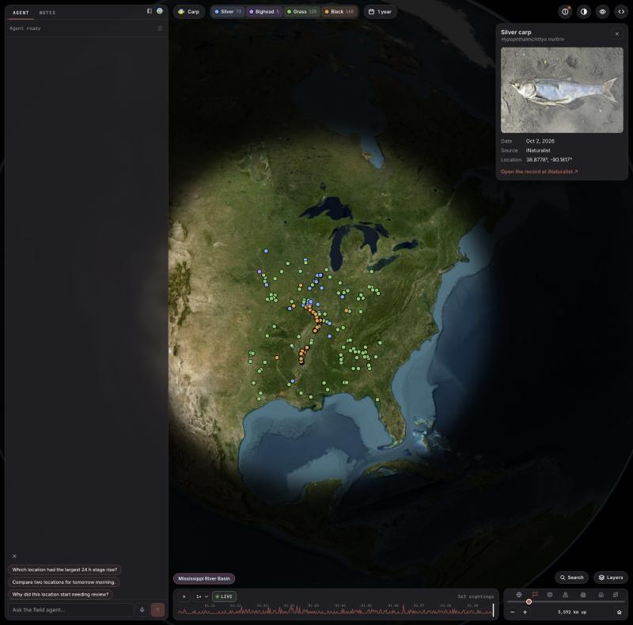
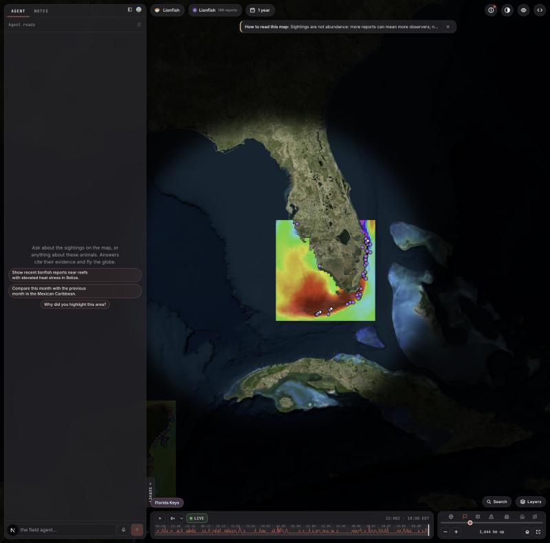
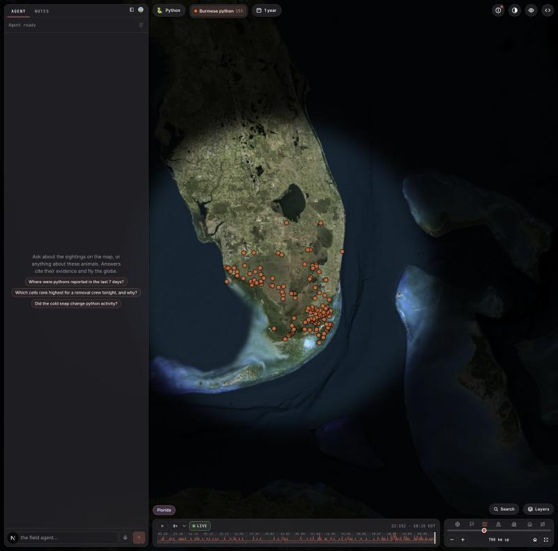

# Inversa take-home: three field apps on one engine

Live: **https://inversa.bigvalue.lol**

A CesiumJS globe over live public feeds, with a field agent you can ask about what you see. One engine (Next.js on Bun + a Rust Axum API with SQLite per app) runs three apps. Pick one with the species button at the top left, or `?app=carp|lionfish|python`.

| App | What the map shows | Default place |
|---|---|---|
| **Carp** (default) | Asian carp sightings (silver, bighead, grass, black) from USGS NAS and iNaturalist, one dot per report, one color per species | Mississippi River Basin |
| **Lionfish** | Lionfish reports (iNaturalist, USGS NAS), NOAA Coral Reef Watch heat maps (DHW, bleaching alert, hotspot, SST), survey priority | Florida Keys |
| **Python** | Burmese python reports (iNaturalist, USGS NAS) | Florida |





## Data sources

Live and polled by the Axum API. Per-source detail, checks and evidence: [docs/DATA_SOURCES.md](docs/DATA_SOURCES.md); live health in the Developer panel (Feeds).

| Source | Apps | What we take |
|---|---|---|
| iNaturalist | carp, lionfish, python | Citizen sightings with photos, polled every 10 minutes |
| USGS NAS | carp, lionfish, python | Curated non-native species records, polled weekly |
| GBIF | lionfish, python | Occurrence records with deep history; copies of iNaturalist are linked, not counted twice |
| EDDMapS (Bugwood, Univ. of Georgia) | python | Reviewer-verified Burmese python occurrences (new) |
| USGS Water Data | carp, python | Gauge stage, discharge and water temperature; carp has nine Mississippi River gauges from St. Paul to Vicksburg (water temperature new) |
| NOAA CO-OPS Tides & Currents | lionfish, python | 6-minute water level and water temperature at coastal stations; Florida Keys stations for lionfish (new) |
| NOAA NWPS | carp | River stage and flow forecasts, flood thresholds |
| IEM river forecast archive | carp | Past NWS river forecasts for replay |
| NWS alerts and gridpoint forecast | carp, python | Active warnings and rain, wind and temperature forecasts |
| NOAA Coral Reef Watch | lionfish | Sea temperature, heat stress (DHW), bleaching alert, hotspot |
| Open-Meteo (marine and forecast) | lionfish, python | Waves and currents; air temperature for the python activity rule |
| NDBC buoys | lionfish, python | Measured sea and air temperature |

Disabled: GOES-19 and NWWS-OI (need AWS and NOAA accounts). AISStream was removed with the vessel layer.

## Roadmap: data sources not added yet

Not integrated. Each needs a sign-up, a request or an agreement first.

| Source | App | Access | Notes |
|---|---|---|---|
| **USGS API key** (optional) | carp, python | Free sign-up at api.waterdata.usgs.gov/signup; set `USGS_API_KEY` in Doppler | The code already reads it. Only raises the rate limit |
| **Global Fishing Watch** | lionfish | Free, needs a token (globalfishingwatch.org/our-apis); the API returns 401 without one | Only pays off if vessel layers return to the UI |
| **REEF volunteer survey data** | lionfish | Free on request, no public API; ask for a data export | Most of it already reaches us through NAS |
| **UF and USGS python telemetry** | python | Free, static dataset from the USGS data release | A history layer, not a live feed |
| **MICRA and RAFT carp acoustic telemetry** | carp | Unverified; likely a download or data request | No public endpoint confirmed |
| **FWC Python Action Team and SFWMD bounty logs** | python | Internal to Inversa | Needs a data export or webhook from Inversa |
| **Sentinel GPS prey project** | python | Needs a data-sharing agreement with the research partners | Not public |

## Using it

- **Period** (top left, next to the species chips): 30 days, 90 days, 180 days, 1 year, 2 years (default). Dots, counts and the timeline all follow it.
- **Species chips**: click to show or hide a species. The number is the count in the period.
- **Place chip** (bottom left, above the timeline): the area in focus.
- **Dots**: hover for details, click to select (pulses) and open the sighting panel on the right.
- **Timeline** (bottom): reports per day as spikes, drag to replay; LIVE jumps back to now.
- **Layers** (bottom right): sightings, reef heat map (lionfish, off by default, drawn at 35% opacity; pick heat stress, alert level, hotspot or sea temperature), radar, clouds, lightning, storms, sea temperature.
- **Live data** (bell, top right): the newest record from each live feed with its age, freshest first. A dot shows when something new arrives.
- **Look** (eye, top right): visual modes and the map window (shape, size, soft edge).
- **Developer** (`<>`, top right): tab **Feeds** shows every data source and its health; tab **API Keys** shows which keys are set and lets you paste missing ones.
- **Agent** (left column): ask about what is on the map; answers cite their sources and can move the globe.

## Run locally

Needs bun, cargo (Rust 1.96+), and CMake plus a C toolchain (the API builds HDF5; the first release build takes a few minutes). Doppler is optional.

```sh
bun install
bun run env      # optional: pull keys from Doppler (inversa/dev) into a git-ignored .env
bun run data     # backfill all three apps from the live APIs (DAYS=30 by default; DAYS=730 for the two years the map shows)
bun run dev      # Axum API on :4041, Next on http://localhost:3050
```

Open http://localhost:3050.

| Command | What it does |
|---|---|
| `bun run api` | Axum API alone (uses Doppler if installed, else `.env`) |
| `bun run api:kill` / `bun run dev:kill` | stop the API / everything `dev` started |
| `bun run check` | full local gate: lint, typecheck, all bun tests, `cargo test` |
| `bun run check:ci` | what CI runs: lint and typecheck (plus `cargo clippy -D warnings`) |
| `bun run eval -- --app carp` | agent benchmark against the live model (needs keys) |

Ports move with `INVERSA_WEB_PORT`, `INVERSA_API_PORT`; `INVERSA_DATA_DIR` moves the databases (default `./data`, one folder per app).

### Keys

The globe works with none of them. Set them in Doppler (`inversa`, config `dev` or `prd`), the shell, or the Developer panel.

| Variable | Enables | Without it |
|---|---|---|
| `OPENROUTER_API_KEY` | the agent (`openai/gpt-6-luna` via OpenRouter) | agent answers 503; there is no mock |
| `NEXT_PUBLIC_CESIUM_ION_TOKEN` | Cesium terrain and aerial imagery | keyless Esri imagery |
| `NEXT_PUBLIC_GOOGLE_MAPS_API_KEY` | Google Photorealistic 3D Tiles (optional) | ion imagery |
| `XAI_API_KEY` | voice | text still works |
| `R2_*` | Litestream backups and raw archive in Cloudflare R2 | local files only |

Agent spend is capped per day ($5 total, $2 per app).

## Deploy (Hetzner CX23, Caddy, systemd, Cloudflare)

Flow: **merge to `main`** → `release.yml` builds the Axum binary and the Next standalone tree and publishes GitHub Release `v0.1.<n>` → run **Actions → deploy** with that `version` (blank = latest; an older version is a rollback). Details in [deploy/README.md](deploy/README.md).

First-time setup, once ([docs/HUMAN_STEPS.md](docs/HUMAN_STEPS.md) has the step by step):

1. VM with Ubuntu, `deploy/` bootstrap script, Caddy and the two systemd units.
2. Cloudflare DNS `inversa.bigvalue.lol` → VM IP, proxied, SSL mode Full (strict).
3. Doppler `inversa/prd` with the keys above plus R2 credentials; a Doppler service token on the VM; GitHub secrets for the deploy SSH key and host.
4. R2 buckets `inversa-litestream` and `inversa-raw`.
5. Backfill on the server, once per app (use `tmux`; each takes a while):

   ```sh
   for a in python carp lionfish; do
     sudo -u inversa bash -c "set -a; . /etc/inversa/env; set +a; INVERSA_DATA_DIR=/var/lib/inversa /opt/inversa/api/inversa-api backfill --app $a --days 730"
   done
   ```

Everything the map reads is stored in SQLite and cached, so visitors never wait on a public API: carp sightings live in the carp database (refreshed every 30 minutes by the API, filled once by the backfill), frames are built once and kept two years (the API warms missing months in the background after a start), and reef heat pictures and weather overlays are fetched once by the server and shared.

Check: `curl https://inversa.bigvalue.lol/api/health` returns 200 (`degraded` only names a missing optional key).

## Architecture

```
Browser: CesiumJS globe, HUD, timeline, workers (active-state over SharedArrayBuffer)
   | /v1/{app}/graphql, /v1/{app}/frames          | /api/agent/stream
   v                                               v
Axum API (Rust)                                Next.js on Bun
  per app: pollers, backfill CLI, carp sightings,            UI, agent
  SQLite writer + read pool, frames
Litestream: SQLite files → R2
```

| Part | Where |
|---|---|
| Pollers (iNaturalist, NAS, GBIF, EDDMapS, USGS Water, CO-OPS, NWPS, IEM, NWS, Coral Reef Watch, Open-Meteo, NDBC) | `api/src/ingest/poll/` |
| Backfill CLI | `api/src/backfill.rs` |
| SQLite, GraphQL | `api/src/db/`, `api/schema.graphql`, `api/src/graphql/` |
| App config (one JSON per app, read by Rust and TS) | `spec/apps/` |
| Map UI | `apps/web/client/` (`carp/`, `lionfish/`, `hud/`, `globe/`) |
| Client state (`@calvinjs/active-state`) | `apps/web/client/state/`, `packages/active-state/` |

Only Axum writes the databases; the agent reaches data only through GraphQL. Each app's data is its own files and every request carries the app in its path.

## Honesty rules

- Stale, missing or conflicting data is shown and named, never filled in.
- Sightings are not abundance: more reports can mean more observers.
- Heat stress is context, not proof of lionfish damage. Survey priority orders places to look; it is not a probability.
- Every number in an agent answer comes from a tool result.

## Known gaps

- **Carp agent still answers about Louisiana river gauges** (its tools and starter questions predate the move to sightings); the map is sightings only. It has no sightings tool yet.
- **Lionfish is heavy on the small server**: the first load of a long period builds many heat-map frames and can take several seconds, especially while a backfill runs.
- **GOES-19 and NWWS-OI feeds are disabled** (need AWS and NOAA accounts).
- **Notes, teammates and the WebRTC signal worker** still exist in the code and UI but are not deployed and are being removed.
- **Lionfish survey card** still carries older layer wording; restyle pending.
- Tests run locally (`bun run check`), not in CI, to keep CI fast.

More background: [docs/brief-compliance.md](docs/brief-compliance.md), [docs/scaling.md](docs/scaling.md), [docs/DATA_SOURCES.md](docs/DATA_SOURCES.md), [docs/security.md](docs/security.md).
