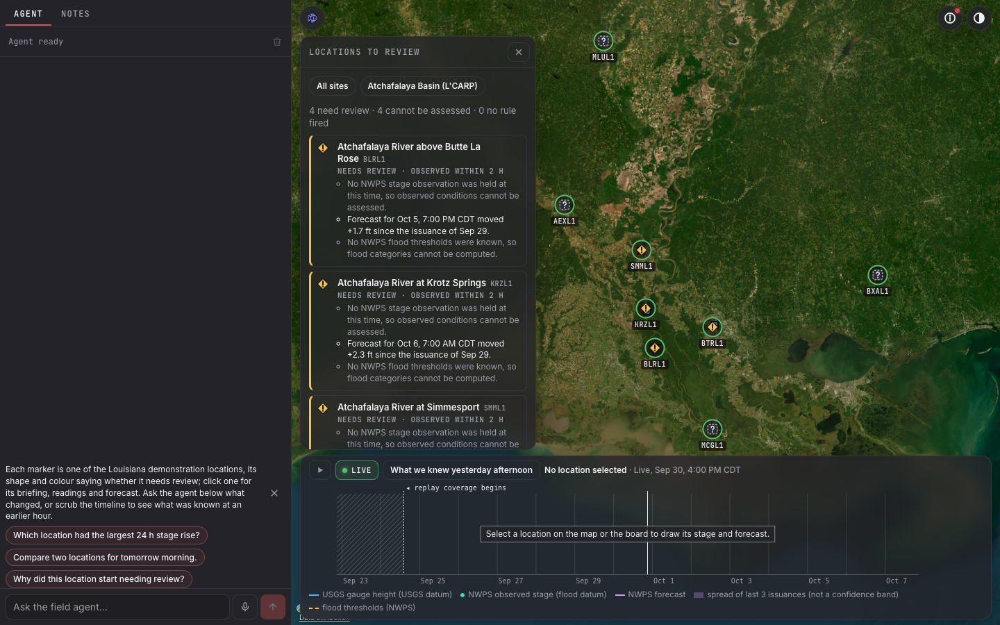

# Inversa take-home: three field apps on one engine

A natural-language interface for exploring questions about the physical world from live public feeds, with evidence you can follow to the raw payload and a timeline that replays what was known at the time. One engine runs three apps, each with its own question, feeds, score, agent and benchmark:

| App | Question | Feeds |
|---|---|---|
| **Carp Field Conditions** (default) | How have river and weather conditions changed around candidate carp-removal locations, and which need operational review today? | USGS Water Data, NOAA NWPS, NWS alerts and forecasts, IEM forecast archive, NWWS-OI (push, pending); on the map: AISStream.io ships (push), NOAA nowCOAST radar, clouds and lightning, NASA GIBS sea temperature, NHC storms |
| **Lionfish Watch** | Where should we prioritize lionfish surveys, given recent sightings, reef heat stress and ocean conditions? | iNaturalist, GBIF, USGS NAS, NOAA Coral Reef Watch, Open-Meteo Marine, NDBC, GOES-19 SST (push, pending); on the map: AISStream.io ships (push), NOAA nowCOAST radar, clouds and lightning, NASA GIBS sea temperature, NHC storms |
| **Everglades Ops** (python) | Where are Burmese pythons active and where should removal crews go next? | iNaturalist, USGS NAS, GBIF, NWS, USGS Water, NDBC, CO-OPS, Open-Meteo, GOES-19 and NWWS-OI (push, pending); on the map: NOAA nowCOAST radar, clouds and lightning, NHC storms |



- Target URL: https://inversa.bigvalue.lol. **Not deployed yet**: the build is production-ready and the deploy waits on the human steps in [docs/HUMAN_STEPS.md](docs/HUMAN_STEPS.md).
- Brief, line by line, with status per app: [docs/brief-compliance.md](docs/brief-compliance.md). Interview prep: [docs/interview-notes.md](docs/interview-notes.md). Design choices: [docs/design-alternatives.md](docs/design-alternatives.md). Scaling: [docs/scaling.md](docs/scaling.md). New technology: [docs/new-technology.md](docs/new-technology.md). Walkthrough: [docs/demo-script.md](docs/demo-script.md). App specs: [docs/APPS.md](docs/APPS.md), [docs/LIONFISH_WATCH.md](docs/LIONFISH_WATCH.md), [docs/PRD.md](docs/PRD.md).

## Run locally

| Tool | Version checked | Why |
|---|---|---|
| bun | 1.3.14 | workspaces, Next, scripts |
| cargo | 1.96.1 | the Axum API in `api/` |
| CMake and Xcode command line tools (Ubuntu: `cmake build-essential zlib1g-dev`) | any recent | `hdf5-metno-src` compiles HDF5 into the API for the GOES decoder; the first release build takes a few minutes |
| doppler (optional) | any | the agent's key comes from Doppler `inversa/dev` |

```sh
bun install
bun run data      # backfill each app (live APIs, 7 days; DAYS=30 for the full replay window) and load the python cold-snap scene
bun run dev       # Axum on 127.0.0.1:4041, Next on http://localhost:3050, signal Worker on 127.0.0.1:8799
```

Open http://localhost:3050. It opens on carp; `?app=lionfish` or `?app=python` opens the others, or use the app selector.

- `bun run dev` needs ports 4041, 3050 and 8799 free (`INVERSA_API_PORT`, `INVERSA_WEB_PORT`, `INVERSA_SIGNAL_PORT` move them). It loads `data/local-keys.env` under the shell and Doppler and restarts the API and web when that file changes. `INVERSA_DATA_DIR` moves the databases (default `./data`, git-ignored; one folder per app). `INVERSA_SOURCES=off` stops all fetching.
- Offline, load the recorded fixtures instead of the live backfill, one app at a time:

  ```sh
  INVERSA_SOURCES=off cargo run -q --release --manifest-path api/Cargo.toml -- backfill --fixtures --app carp
  ```

  Each prints `BACKFILL-OK` (re-measured 2026-10-01: carp 0.07 s, lionfish 2.1 s, python 0.9 s on the release binary).

### Other commands

| Command | What it does |
|---|---|
| `bun run check` | lint, typecheck, all bun tests, `cargo test`; prints `CHECK-OK`. Re-measured 2026-10-01: web 997 pass, active-state 96, signal-worker 37, active-theme 4, API 365 passed, all 0 failed |
| `bun run eval -- --app carp` | the blind agent benchmark for one app against the live model (needs Doppler); `--holdout` runs the held-out set |
| `bun run grade` | scores the submission against the rubric in [docs/grading/rubric.md](docs/grading/rubric.md) and writes `docs/grading/report.md`; `--fast` skips e2e and live checks |
| `bun run check:questions` | validates the three question files and prints their counts |
| `bun run --cwd apps/web e2e:firstload --app carp` | Playwright on the real stack: what a newcomer sees; `--evidence-shots` also writes `docs/evidence/<app>-desktop.png` and `docs/evidence/mobile/<app>-375.png` |

### Keys (all optional; Doppler, the shell, or the Developer panel)

The globe runs with no key at all. The **Developer** button (`<>`, top right) opens "Power up the globe": one row per provider, set or missing, a MANAGE or GET KEY link, and a password field for each missing key. Browser-side keys are stored in that browser's localStorage and never sent to our server. Server-side keys pasted there are written to `data/local-keys.env` (git-ignored, mode 0600) only under `bun run dev` on loopback; `bun run dev` then restarts the API and web with them. A key set in the shell or Doppler wins over that file and shows CONFIGURED EXTERNALLY. Anywhere else the panel shows the `doppler secrets set NAME` command. Step by step: [docs/HUMAN_STEPS.md](docs/HUMAN_STEPS.md) section 14.

| Variable | Where | Get it | Enables | Without it |
|---|---|---|---|---|
| `NEXT_PUBLIC_GOOGLE_MAPS_API_KEY` | browser: Developer panel or build env | https://developers.google.com/maps/documentation/tile/get-api-key (enable Map Tiles API, restrict by HTTP referrer) | Google Photorealistic 3D Tiles direct, tried before ion; capped at 1,000 sessions per browser per month (editable in the panel) | Google 3D through ion, else none |
| `NEXT_PUBLIC_CESIUM_ION_TOKEN` | browser: Developer panel or build env | https://ion.cesium.com/tokens | Cesium World Terrain, Bing aerial and Google 3D through ion | keyless Esri imagery |
| `AISSTREAM_API_KEY` | server | https://aisstream.io/apikeys | live ships in carp and lionfish (Layers, Ships), and the agent's `vessels` tool | the ships layer replays stored history; the feed reads DOWN with the reason |
| (none) | | | Water and weather (NOAA nowCOAST radar, clouds, lightning; NASA GIBS sea temperature; NHC storms) through the same-origin overlay proxy | always on offer in Layers |
| `OPENROUTER_API_KEY` | server | https://openrouter.ai/settings/keys | the agent: `openai/gpt-6-luna` on OpenRouter | `/api/agent/stream` answers 503 `agent unavailable`; there is no mock or scripted fallback |
| `XAI_API_KEY` | server | https://console.x.ai/ | voice through the grok-voice relay | voice answers 503; text works |
| `GOES_SQS_URL`, `AWS_ACCESS_KEY_ID`, `AWS_SECRET_ACCESS_KEY` | server | AWS console, see docs/HUMAN_STEPS.md section 7 | GOES-19 push (python, lionfish) | the GOES feed reads DOWN with the reason |
| `NWWS_USER`, `NWWS_PASS` | server | email `NWWS.Issue@noaa.gov`, docs/HUMAN_STEPS.md section 8 | NWS products over NWWS-OI XMPP | `nwws` reads DOWN; the `api.weather.gov` poll covers alerts |
| `INGEST_HOOK_SECRET`, `INGEST_NUDGE_TOKEN` | server (Doppler) | you choose them | the signed ingest webhook and provider nudges | hook and nudges answer 503; feeds still poll |
| `R2_*` | server (Doppler) | docs/HUMAN_STEPS.md section 3 | raw payload archive and Litestream in R2 | raw payloads go to `<data dir>/archive/` |

Google bills Map Tiles per root-tileset request after a monthly free allowance. Check the current price at https://developers.google.com/maps/billing-and-pricing/pricing before you enable billing; this README does not state it.

Agent spend is capped per day: $5 across all apps, $2 per app, priced at $0.10/M input and $0.50/M output (`apps/web/server/agent/budget.ts`).

## Using it

### The app selector

The round species icon at the top left of the globe opens a popover listing the three apps with icon, name, one-line question and a feed-health dot. Choosing one swaps the config, map preset, layers, helper questions, agent and timeline; the choice lives in the URL (`?app=`) and is remembered in the browser. Keyboard: Enter opens it, Escape closes it and returns focus.

### Carp: what to try

1. Read the **Locations to review** board: each site says "needs review", "no rule fired" or "cannot be assessed", with the reasons in words. Click **Atchafalaya Basin (L'CARP)** to frame the four basin sites.
2. Click KRZL1 (Krotz Springs). The timeline draws USGS gauge height and NWPS stage on different datums, with a "sources disagree" chip that explains the datum offset (2.45 ft in the C1 probe).
3. Press **What we knew yesterday afternoon**. The board and forecast switch to what was held then (the forecast issued at or before that time, labelled `nwps-live` or `iem-archive`); later observations are drawn apart. LIVE returns.
4. Ask a starter question: "Which location had the largest 24 h stage rise?" or "Why did this location start needing review?". Click a citation to open the record and its source page.

### Lionfish: what to try

1. Read the honesty banner: reports are not abundance, heat stress is context, priority is not a probability.
2. Open the **Lionfish survey** panel: four areas, Belize and Colombia marked "Thin data". Switch **Observed date** to **Submitted date** and watch the counts change, with the explanation.
3. Click a numbered priority cell: four components side by side, DHW and BAA together, the field window kept apart.
4. Ask "Show recent lionfish reports near reefs with elevated heat stress in Belize." or "Where does this number come from?".

### Python: what to try

1. Snake markers are Burmese python reports in the last 7 days. Hover one for the ID grade, click it for the evidence card.
2. Ask "Which cells rank highest for a removal crew tonight, and why?": the answer names the score's terms (density, activity, access) and calls it a heuristic.
3. Type `2026-02-01` in the timeline's date field and press Enter: the window moves to the February 2026 cold snap; switch on Alerts and Hotspots under About, More data, and press Play.
4. Ask "Which feeds are stale right now?": each stale or down source is named with its state.

### Real-time notes and direct messages (two browsers)

Open the same app in two browser windows. In the **Notes** tab, pick a spot on the globe and write a field note: the other window sees the pin and the text as it is typed, with the author's caret. Direct messages, a thread per teammate in the same tab, stream per keystroke to the other window with an "is typing" line, and commit on Enter. Under the hood: CRDT ops over WebRTC data channels, with the GraphQL WebSocket as fallback and durable copy.

### Controls

**Help**, inside About, lists every control; its text lives in [`apps/web/client/hud/help/content.ts`](apps/web/client/hud/help/content.ts), and a unit test fails if this table misses one. Rows marked carp or species apply only to that kind of app.

| Where | Control | What it does |
|---|---|---|
| Map | App selector | Top left: switches between carp, Lionfish Watch and Everglades Ops. |
| Map (species) | Species chip | The app's one species with its icon, colour and count in the window; click to show or hide its markers. |
| Map (species) | Sighting markers | One per reported animal, brightest when newest; hover for how sure the ID is, click for the record. |
| Map (species) | Evidence card | What was seen, where, when and how sure, the Latin name, the photo, the publisher link; the raw record under Details for experts. |
| Map (carp) | Location markers | One per demonstration river location: ◆ ! needs review, ● ✓ no rule fired (not "safe"), dashed ■ ? cannot assess; freshness as a ring. |
| Map (carp) | Review board | Every location, those needing review first, with reasons in words; the All sites and Atchafalaya Basin presets; the conditions-only notice. |
| Map (carp) | Location briefing | What changed, what is expected, what is missing; readings with units and times, forecast issuance and source, thresholds, alerts, source pages. |
| Map | About (ⓘ) | Top right: what the map is, how fresh its data is, Focus, Help, Data sources and More data (for experts). |
| Map | Data sources | Inside About: one row per source with its health (nominal, lagging, stale, down), push or poll, and lag. |
| Map | More data (for experts) | Inside About: a switch, legend and live count for every expert layer (stations, alerts, hotspots, temperature grids, missions, cursors). |
| Map | Look | Top right, the eye: seven looks (Normal, CRT, NVG, FLIR, Noir, Anime, Snow) and the map window, always clear: its shape (circle, oval, rounded, frame) and its size, and a soft edge that fades the map out past it (sharp at 0, no vignette at 100). |
| Map | Layers | Bottom of the map, beside the place search: sightings and field notes (on at first), Ships (carp and lionfish) and Water and weather, one plain line each; every layer follows the timeline. |
| Map (carp, lionfish) | Ships | Inside Layers: AIS ships by type with fading trails, moving with the timeline; a click opens the ship with its VesselFinder page in a new tab. |
| Map | Focus | Inside About: dims the globe outside a circle around the selection. |
| Map | Theme (◐) | Top right: light, dark or tactical, remembered. |
| Map | Developer (<>) | Top right: "Power up the globe", every API key with set or missing, where to get it and a paste field (see Keys below). No value is ever shown. |
| Map | Help | Inside About: opens the help sheet. |
| Map | Share links | The address bar holds the app, camera, time, layers and selection. |
| Timeline (species) | Play / pause (Space) | Plays time forward at the chosen speed. |
| Timeline (species) | Speed | Playback speed in frames per second. |
| Timeline (species) | LIVE / REPLAY | Now or the past; click while replaying to jump to now. |
| Timeline (species) | Date jump | Loads any UTC day, including days outside the loaded window. |
| Timeline (species) | Scrubber | Drag, or arrow keys; hatched stretches are gaps in the data. |
| Timeline (carp) | Stage timeline | USGS gauge height, NWPS observed stage and forecast with the spread of recent issuances, flood thresholds, alerts, the replay-coverage marker, "sources disagree" chips. |
| Timeline (carp) | What we knew | Scrub, or press What we knew yesterday afternoon: everything shows what was held then. |
| Chat column | Agent tab | Ask the agent; answers cite evidence, show their tools and data, and move the map. |
| Chat column | Notes tab | Field notes pinned to the globe, team chat, direct messages, who is online, crew missions. |
| Chat column | Mic | Talk instead of typing (needs `XAI_API_KEY`). |
| Chat column | Citations [1] [2] … | Open the cited record in the evidence card. |
| Chat column | Data panels and Expand | Tables and charts behind an answer; Expand opens them wide. |
| Chat column | Column edge | Drag or use the arrow keys to resize the column; on phones, drag the sheet's handle. |

### Honesty rules every app follows

- Stale, missing and conflicting data are shown and named, never hidden or filled in. A feed without its account reads DOWN with the reason.
- No single risk or probability number. Scores show their parts and are labelled as heuristics.
- Sightings are not abundance. Conditions are not catch, legal access or trip safety. The agent refuses or caveats those questions.
- Every number in an answer must come from a tool output, and every citation must be an id a tool returned in that turn.

## Architecture

```
 Browser (one tab)
   main: chat column, CesiumJS globe, HUD, timeline
   workers: gql (GraphQL HTTP + WS), db (sqlite-wasm on OPFS, CRDT, frame cache), rtc (WebRTC data channels)
   SharedArrayBuffer rings between threads (active-state ./threads)
        | /v1/{app}/graphql, /v1/{app}/frames          | /api/agent/stream (NDJSON)
        v                                              v
   Axum API (Rust)                                 Next.js on Bun
     AppRegistry: carp | lionfish | python           UI shell, agent (cordis, GPT-6 Luna on OpenRouter)
     per app: pollers, push consumers, scheduler,    agent tools call /v1/{app}/graphql over loopback
       SQLite writer + read pool, frames, hub
     signed webhook  POST /v1/{app}/ingest/hook/{source}
     nudges          /v1/{app}/ingest/nudge/{source}/{token}
   Litestream: every app's SQLite files to R2

 Cloudflare Worker + R2: WebRTC signalling (SDP and ICE only), TURN credentials
 AWS SQS: GOES-19 SNS topic (pending)       NWWS-OI XMPP (pending)
```

| Part | What it is | Where |
|---|---|---|
| Pollers | tokio tasks per feed per app under a rate governor (backoff on 429/5xx, `Retry-After`) | `api/src/ingest/poll/`, `api/src/ingest/governor.rs` |
| Push consumers | GOES-19 SQS long-poll; NWWS-OI XMPP | `api/src/ingest/push/` |
| Webhooks | one HMAC-signed hook for any raw provider body; idempotent on the body hash | `api/src/ingest/push/hook.rs` |
| Nudges | IEMBot and ERDDAP subscriptions wake a poller; the payload is never trusted | `docs/ingest-modes.md` |
| SQLite | `observations.db` and `team.db` per app, one writer thread, WAL readers | `api/src/db/` |
| GraphQL | per app, HTTP and WebSocket subscriptions; frames over REST | `api/schema.graphql`, `api/src/graphql/` |
| WebSockets | feed state, frame updates and team ops fan out from each app's hub | `api/src/realtime.rs` |
| Workers | gql, db and rtc workers in the browser | `apps/web/client/threads/` |
| active-state | shared state across threads over SharedArrayBuffer | `packages/active-state/` |
| WebRTC | peer mesh (up to 8) for notes, DMs, cursors; signalling Worker | `apps/web/client/threads/rtc/`, `apps/signal-worker/` |
| App config | one JSON per app, one schema, read by Rust and TS | `spec/apps/` |

Boundaries: only Axum writes the server databases; the agent has no database access and reaches data only through GraphQL; each app's data is in its own files and every request carries the app in its path (`/v1/<app>/...`); the CRDT merge exists in Rust and TypeScript and both pass the same vectors.

## Status and known gaps

- **Not deployed** (see above).
- **GOES-19 and NWWS-OI push** wait on an AWS queue and a NOAA account; both read DOWN with the reason.
- **Agent benchmark**: grounding holds (`ungrounded=0`) in every final run, but the rubric's 95%/90% bars are not met three runs in a row by any app; numbers in [docs/brief-compliance.md](docs/brief-compliance.md) row 23.
- **Agent first token**, re-measured 2026-10-01 with `e2e:perf --app`: carp p50 1,123 ms, lionfish 1,272 and 1,343 ms, python 1,566 and 1,584 ms; the rubric's bar is 1,200 ms. The python run also failed its answer-cache check twice: a repeated question was answered by the model again instead of from the cache.
- **Phone layout**, from the 375 px screenshots: carp's opening camera shows only part of the eight sites and the timeline's hint text is clipped; lionfish's honesty banner covers the top third of the map until dismissed.
- Every task's gates file is under [gates/](gates/); gates blocked on a human step carry an `ABANDON` line naming it.
